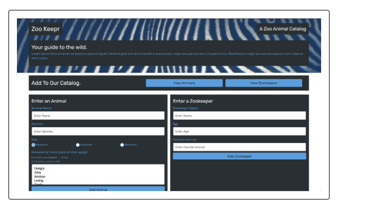

# zookeepr
Module 11: Express.js (First Full Stack Web Development)

## Purpose
Create a web server using the Express.js framework and add it to a front-end application that the local zoo is developing, called Zoo Keepr. 
The site’s data will live on the server I build so that anyone can access it without having to download it. 
Deployed my application to Heroku, a cloud application platform that allows me to deploy applications with servers to a webpage.

## Built With
* Express.js
* Insomnia
* Heroku
* Git Hub

## Contribution
Made with ❤️ by Samantha Malone
Shout out to my tutor
© 2021 Samantha Malone. All rights reserved.
